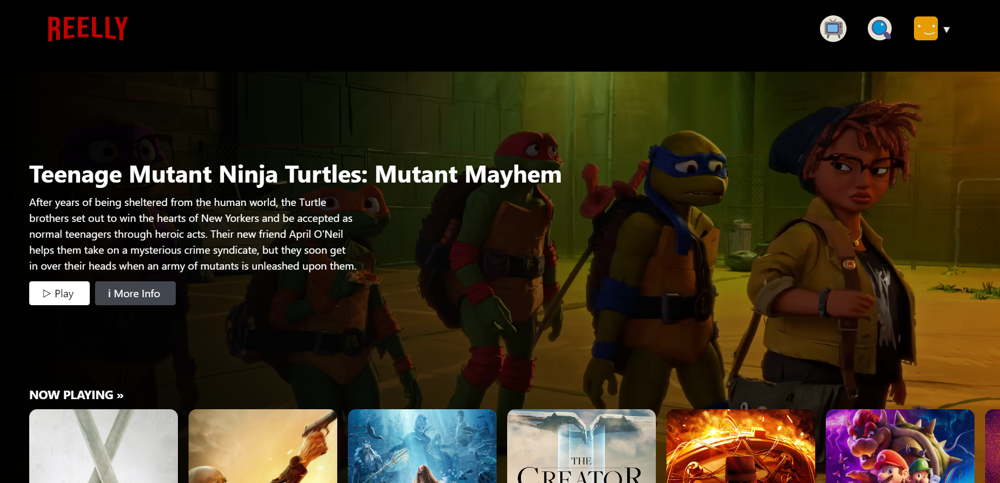

# REELLY

Reelly uses the power of OpenAI's GPT-3.5 language model to generate movie recommendations, just like the way Netflix recommends content to its users. This project combines the capabilities of GPT-3.5 with data from TMDB to provide personalized content suggestions.

## Table of Contents

- [Features](#features)
- [Demo](#demo)
- [Technology Stack](#technology-stack)

## Features

- **Content Recommendations**: Generate movie recommendations using OPENAI Turbo APIs based on user input or preferences.

- **Content Descriptions**: Create detailed descriptions of movies and TV shows for a given title or genre.

- **Watchlist**: Save your favorite movies to a personalized watchlist for easy access later.

- **Multiple Language Support**: Search for content and interact with the model in multiple languages for a global user base(currently available languages: ENGLISH & HINDI).

- **User Login and Authentication**: Securely authenticate users, allowing them to create accounts, log in, and personalize their experience.

- **Data Sources**: Utilize TMDb to render content data and descriptions.

- **Category-Wise Movies Listing**: Explore movies categorized by ratings, release years, and more for easy browsing.

## Demo

Check out the live demo of Reelly: [Reelly Demo](https://reelly-1b941.web.app/)

## Technology Stack

Reelly is built using the following technologies:

- **React with Typescript**: The core programming language used for building the application logic.

- **Firebase**: A cloud-based platform for user authentication, hosting and deploying web application.

- **OpenAI GPT-3.5**: The powerful language model from OpenAI used for generating recommendations and content descriptions.

- **TailwindCSS**: A utility-first CSS framework used for fast, efficient and responsive styling of web components.

- **GitHub**: Version control and project management.

- **TMDb (The Movie Database)**: TMDb is used as a data source for accessing movie data, enhancing content recommendations, and providing additional information about the movie.

This technology stack enables Reelly to provide a robust and interactive user experience while harnessing the power of AI for content recommendations and descriptions.
